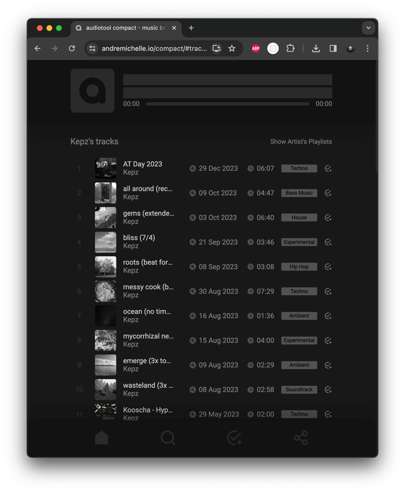

# Compact

### A Mobile Friendly Audiotool Music Navigator

* Can be installed as PWA (runs offline)
* Download tracks to make them offline available

[Open in browser ⏏︎](https://andremichelle.io/compact)

Tested on

* Desktop (Mac)
    * Chrome
    * Firefox
    * Safari
* Mobile (IOS)
    * Chrome
    * Safari

#### Build

* `npm install` (install all dependencies)
* `npm run dev` (build and run webserver)
* `npm run build` (build and deploy to `/dist`)

#### Toolchain

* [JSX](https://github.com/andremichelle/jsx/)
* Vite
* Sass